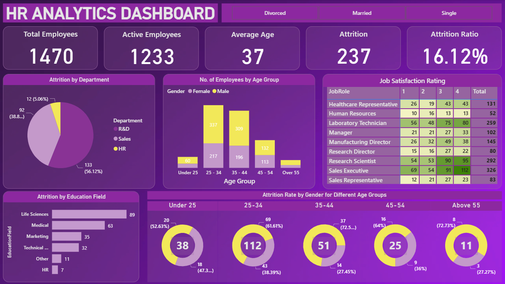

# HR Analytics Dashboard 📊

> A Power BI dashboard analyzing employee attrition across 1,470 employees, uncovering workforce trends by department, age group, education field, gender, and job satisfaction to support data-driven HR decisions.

---

## 📌 Overview

Employee attrition is one of the most costly challenges HR teams face. This dashboard was built to answer a critical question: **who is leaving, and why?**

Using a cleaned HR employee dataset, the dashboard breaks down attrition patterns across multiple dimensions including department, age group, education background, and gender, giving HR managers a clear and interactive view of workforce retention risks.

---

## 🖼️ Dashboard Preview

---

## 🔍 Key Insights

- Out of **1,470 total employees**, **1,233 are active** while **237 have left**, giving an attrition ratio of **16.12%**
- **R&D department** accounts for the majority of attrition at **56.12%**, followed by Sales at **38.8%** and HR at **5.06%**
- The **25-34 age group** has the highest employee count, making it the most at-risk segment for attrition volume
- **Life Sciences** dominates attrition by education field with **89 employees**, followed by Medical at **63**
- **Male employees in the 25-34 age group** show the highest attrition count at **69 employees (61.61%)**
- **Job satisfaction is lowest** among Laboratory Technicians and Research Scientists, which aligns with the high R&D attrition rate
- The average employee age across the organization is **37 years**

---

## 🧹 Data Cleaning (Python Notebook)

The dataset was cleaned using Python before being loaded into Power BI:

- Identified and confirmed no redundant (duplicate) columns using a custom function
- Dropped columns with a single unique value that add no analytical value
- Verified zero null values and zero duplicate rows
- Performed full EDA including correlation heatmap, distribution plots, pairplot by gender, pie charts for categorical features, and a pandas-profiling report
- Exported the cleaned dataset ready for Power BI import

---

## 🛠️ DAX Measures

| Measure | Description |
|---------|-------------|
| `Total Employees` | Total count of all employees in the dataset |
| `Active Employees` | Count of employees where Attrition = No |
| `Attrition` | Count of employees where Attrition = Yes |
| `Attrition Ratio` | Percentage of employees who left out of total |
| `Average Age` | Average age across all employees |

---

## 🔧 Advanced Features

- **Marital Status Filter:** Slicer at the top filters all visuals by Divorced, Married, or Single
- **Job Satisfaction Matrix:** Heatmap-style matrix showing satisfaction ratings (1-4) per job role with color-coded values
- **Attrition Rate by Gender per Age Group:** Set of donut charts showing male vs female attrition split across 5 age bands

---

## 🛠️ Tools and Techniques

| Tool | Usage |
|------|-------|
| **Power BI Desktop** | Dashboard design, data modeling, DAX measures |
| **Python (Pandas, Seaborn, Plotly)** | Data cleaning and exploratory data analysis |
| **pandas-profiling** | Automated EDA report generation |
| **Jupyter Notebook** | Data cleaning workflow and visualization |

**Visualizations used:** KPI cards, Pie chart, Clustered bar chart, Matrix table, Horizontal bar chart, Donut charts

---

## 📁 Dataset

The dataset contains HR employee records including demographics, job role, department, education, satisfaction ratings, and attrition status.

📂 [View Dataset](data/HR-Employee-Attrition.csv)
